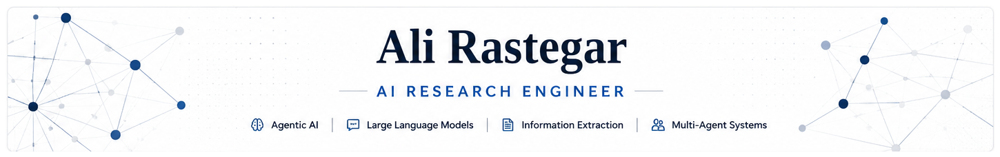

  

# Hi, I'm Ali Rastegar 👋

AI engineer and researcher interested in **Agentic AI**, **Large Language Models**, **Information Extraction**, **Multi-Agent Systems**, and **Biomedical NLP**.

🎓 M.Sc. in Computer Science — **University of Milan (110/110 cum laude)**

---

## 📄 Publication

**Schema-Driven Structured Information Extraction from Biomedical Literature via Large Language Models**

Submitted to **ACM CIKM 2026**

  

  

  

